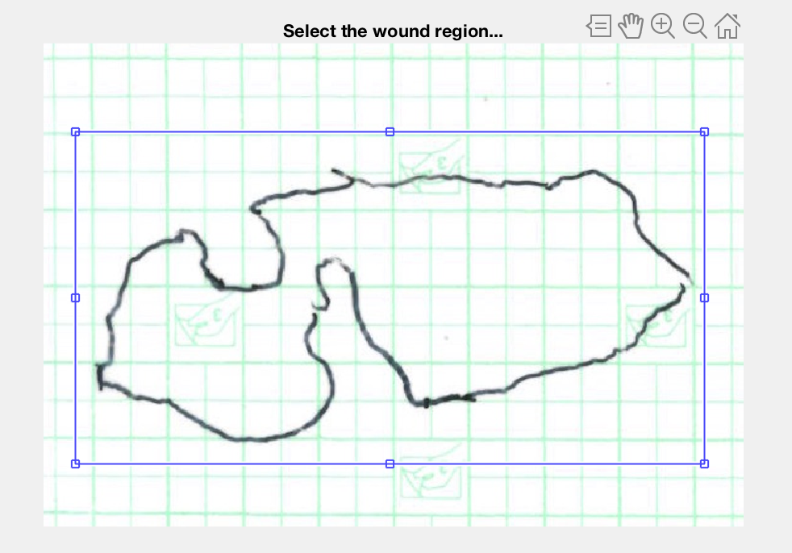
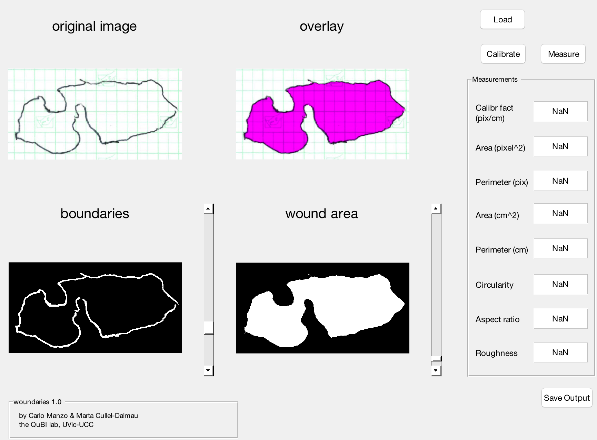

# woundaries
A Matlab GUI to fit to calculate area and other geometric estimators of wound from digitized hand-traced planimetries. 
To sliders are used to obtain the . Calibration can be obtained from the underlying grid. 

## Prerequisites
Matlab 2013a (The Mathworks Inc., www.mathworks,com) or later.

### Running the code
Run woundaries.m in Matlab. The initialized GUI will open. 

### Load data
By pushing the "Load" button, a window will pop up asking to choose the image file to be loaded. An example file ('example.jpg') is provided. The loaded image will appear in a separate window and the software will wait for the user  to draw a rectangle around the area of interest and then double click.

### Adjusting the sliders
The image and the estimated boundaries and area will then appear in the main window. The two sliders can be interactively adjusted to fill gaps in the contour and provide a reliable estimation of the wound area.
 Clicking the "Measure" button will provide the quantification of geometric estimators. If a calibration is not provided, dimensional estimators will be given in pixels.

.

### Area calibration
By pushing the "Calibrate" button, a window will pop up allowing to select the area of the grid corresponding to a square centimeter. Once this operation is performed, the software will automatically calculate the geometric estimators of the wound in the correct units.

### Save output
Clicking the "Save output" button generates a *.txt file containing the results of the measures.